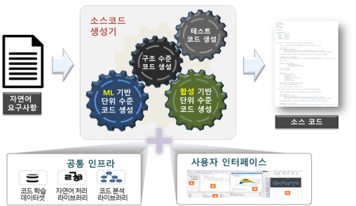

# Autocode

Research on technology that automatically generates high-quality source code from requirements written in natural language, execution examples, or partially written source code.

>-  Automatic source code generation technology that combines new and existing techniques such as machine learning (language model), program synthesis, and software engineering.



## Overview

This repository contains tools and frameworks for code generation and evaluation using language models. The project leverages LangGraph and various language model APIs to provide a robust environment for code generation tasks.

## Prerequisites

- Python 3.10 or higher
- CUDA-compatible GPU (recommended for optimal performance)
- Virtual environment (recommended)

## Installation

1. Create and activate a virtual environment:
```bash
python -m venv test
source test/bin/activate 
```

2. Install dependencies:
```bash
pip install -r requirements.txt
```

## Configuration

1. export OPENAI_API_KEY in your .bashrc file in HOME directory
```bash
vi ~/.bashrc
### add the following line for setting OPENAI_API key ###
export OPENAI_API_KEY='sk-(your key)'
```

## Usage

The project provides two main functionalities:

### Code Generation

#### GPT-4
```bash
python3 run.py
```

## Project Structure

```
autocode/
├── configs/         # Configuration files
├── templates/       # Template files
├── src/             # Third-party dependencies
├── inputs           # input directory that contains input data
├── run.py           # Main entry point
├── networks         # network directory (langgraph)
├── generator.py     # main generator file
└── requirements.txt # Python dependencies
```

## Development

- Configuration files are stored in `configs/`
- Templates for code generation are in `templates/`

