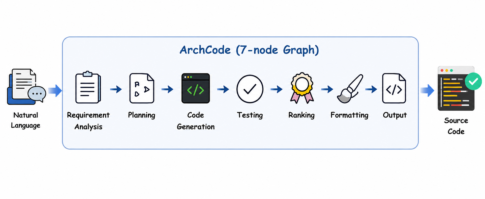
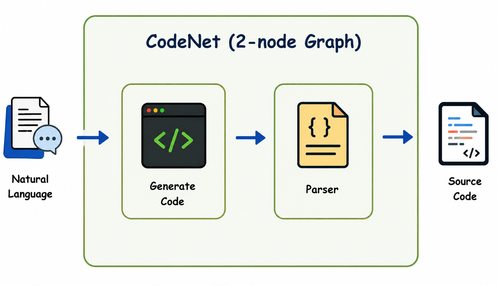
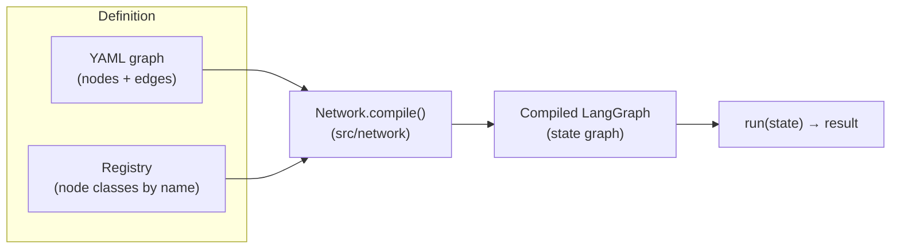

[![Contributors][contributors-shield]][contributors-url]
[![Forks][forks-shield]][forks-url]
[![Stargazers][stars-shield]][stars-url]
[![Issues][issues-shield]][issues-url]
[![ETRI License][license-shield]][license-url]


<!-- PROJECT LOGO -->
<br />
<div align="center">
  <a href="https://github.com/auto-code-etri/autocode">
    
  </a>

  <h3 align="center">PULSE</h3>

  <p align="center">
    Pipeline for Unified LLM Software Engineering
    <br />
    <a href="https://github.com/auto-code-etri/autocode/issues/new?labels=bug&template=bug-report---.md">Report Bug</a>
    &middot;
    <a href="https://github.com/auto-code-etri/autocode/issues/new?labels=enhancement&template=feature-request---.md">Request Feature</a>
  </p>
</div>


<!-- TABLE OF CONTENTS -->
<details>
  <summary>Table of Contents</summary>
  <ol>
    <li>
      <a href="#about-the-project">About The Project</a>
      <ul>
        <li><a href="#pipelines">Pipelines</a></li>
        <li><a href="#built-with">Built With</a></li>
      </ul>
    </li>
    <li><a href="#architecture">Architecture</a></li>
    <li><a href="#repository-structure">Repository Structure</a></li>
    <li>
      <a href="#getting-started">Getting Started</a>
      <ul>
        <li><a href="#prerequisites">Prerequisites</a></li>
        <li><a href="#installation">Installation</a></li>
        <li><a href="#configuration">Configuration</a></li>
      </ul>
    </li>
    <li><a href="#usage">Usage</a></li>
    <li><a href="#references">References</a></li>
    <li><a href="#contributing">Contributors</a></li>
    <li><a href="#license">License</a></li>
    <li><a href="#Acknowledgment">Acknowledgment</a></li>
  </ol>
</details>


<!-- ABOUT THE PROJECT -->
## About The Project

**PULSE** is a large language model–based framework that automatically generates **expert-level, high-quality source code** from natural language requirements.

This project provides the following key features:
- Analyzes user requirements to generate **structured, testable, and maintainable code**, producing results that go beyond simple code snippets to practical, production-ready outputs.
- Supports a **structured pipeline and multiple language model environments**, making it suitable for both research and real-world development.

At its core, PULSE is a framework designed to maximize **code reusability**, built on three foundations —
a node **Registry**, declarative **YAML** graph definitions, and **LangGraph** as the execution engine (see
[Architecture](#architecture)).

<div align="center">
  <a href="https://github.com/auto-code-etri/autocode">
    
  </a>
</div>

### Pipelines

PULSE ships with two ready-to-run network pipelines.

#### ArchCode

A 7-node pipeline that turns a requirement into ranked, verified code:
`RequirementGenerator → PlanGenerator → {CodeGenerator, FuncTestCaseGenerator, NonFuncTestCaseGenerator}
(parallel) → PythonCodeExecutor → ExecutionResultFormatter`. Generated code is executed and ranked against
functional / non-functional requirements. Defined in
[networks/archcode/ArchCode_etri.yaml](networks/archcode/ArchCode_etri.yaml). See
[docs/ARCHCODE.md](docs/ARCHCODE.md) for details.

<div align="center">
  
</div>

> **Based on the paper** [*ArchCode: Incorporating Software Requirements in Code Generation with Large
> Language Models*](https://aclanthology.org/2024.acl-long.730/) (Han et al., ACL 2024) —
> [original code](https://github.com/ldilab/ArchCode).
>
> ArchCode uses in-context learning to organize the **functional and non-functional requirements** stated
> in a description and to infer unexpressed ones, then generates requirement-specific test cases that rank
> candidate code by how well it satisfies those requirements. It improves functional correctness (Pass@k)
> and introduces **HumanEval-NFR**, the first benchmark for evaluating non-functional requirements in LLM
> code generation. PULSE re-implements this pipeline as a LangGraph network under `networks/archcode`.

#### CodeNet

A lightweight 2-node pipeline (`CodeGenerator → JsonParser`) for straightforward code generation. Defined in
[networks/codenet/CodeNet.yaml](networks/codenet/CodeNet.yaml).

<div align="center">
  
</div>

<p align="right">(<a href="#readme-top">back to top</a>)</p>


### Built With

* [![Lang][Langchain]][Langchain-url]
* [![Dock][Docker]][Docker-url]

Language model backends supported by `GeneralChatModel` ([src/model/chat.py](src/model/chat.py)):
**OpenAI**, **vLLM**, and **Ollama**.

<p align="right">(<a href="#readme-top">back to top</a>)</p>


<!-- ARCHITECTURE -->
## Architecture

PULSE is designed to maximize **code reusability**. Instead of hard-coding pipelines, each pipeline is
composed from reusable building blocks assembled at runtime. This rests on three foundations:

- **Registry** — Every node is a self-contained, reusable unit registered by name through
  [`autoregistry`](https://github.com/BrianPugh/autoregistry) in
  [src/utils/registry.py](src/utils/registry.py). Once registered, a node can be dropped into **any**
  pipeline just by referencing its name — no imports or wiring changes required.
- **YAML** — A pipeline is declared as data, not code. A graph's nodes and edges live in a YAML file (e.g.
  [networks/archcode/ArchCode_etri.yaml](networks/archcode/ArchCode_etri.yaml)), so you can rearrange,
  extend, or create new pipelines by editing configuration and reusing existing registered nodes.
- **LangGraph** — At runtime the resolved nodes and edges are built into a state graph and executed by
  [LangGraph](https://langchain-ai.github.io/langgraph/), which handles state passing, branching, and
  parallel execution.

The pieces come together in [src/network/network.py](src/network/network.py): the YAML graph is parsed,
each node name is looked up in the registry, and the graph is compiled into a runnable LangGraph.


```mermaid
flowchart LR
    subgraph Definition
        Y["YAML graph<br/>(nodes + edges)"]
        R["Registry<br/>(node classes by name)"]
    end
    Y --> N["Network.compile()<br/>(src/network)"]
    R --> N
    N --> G["Compiled LangGraph<br/>(state graph)"]
    G --> O["run(state) → result"]
```

<p align="right">(<a href="#readme-top">back to top</a>)</p>


<!-- REPOSITORY STRUCTURE -->
## Repository Structure

```
autocode/
├── run.py                  # Entry point for the CodeNet pipeline
├── src/                    # Core library
│   ├── model/              #   LLM wrapper (GeneralChatModel)
│   ├── network/            #   Graph config / build / execution
│   ├── prompt/             #   Prompt construction
│   └── utils/              #   Node registry
├── networks/               # Pipeline implementations
│   ├── archcode/           #   ArchCode network (+ ArchCode_etri.yaml)
│   └── codenet/            #   CodeNet network (+ CodeNet.yaml)
├── configs/                # Model / pipeline configs (e.g. llm/gpt4-greedy.yaml)
├── templates/              # Prompt / example / eval templates
├── third_party/            # Git submodules
│   ├── etri_langgraph/     #   LangGraph wrapper (installed as a package)
│   └── CodeExecContainer/  #   Sandboxed code execution service
├── inputs/                 # Input data (data.json)
└── outputs/                # Generated results (output.json)
```

<p align="right">(<a href="#readme-top">back to top</a>)</p>


<!-- GETTING STARTED -->
## Getting Started

Follow these steps to get a local copy up and running.

### Prerequisites

- Python 3.11.10
- [uv](https://docs.astral.sh/uv/) (a fast Python package installer and resolver)
- Docker — required only for running the `CodeExecContainer` sandbox (used by ArchCode code execution)

### Installation

1. Install uv:

```bash
curl -LsSf https://astral.sh/uv/install.sh | sh
```

2. Create and activate a virtual environment:

```bash
uv venv autocode --python 3.11.10
source autocode/bin/activate
```

3. Install dependencies and submodules:

```bash
uv pip install -r requirements.txt
git submodule update --init --recursive
uv pip install -e third_party/etri_langgraph
```

### Configuration

Create a `.env` file at the root of the project:

```bash
OPENAI_API_KEY=xxxx
CODEEXEC_ENDPOINT=http://localhost:5097/execute
```

> When using a non-OpenAI backend, set the corresponding base URL instead:
> `OPEN_WEBUI_BASE_URL` for vLLM, or `OLLAMA_BASE_URL` for Ollama.

<p align="right">(<a href="#readme-top">back to top</a>)</p>

<!-- USAGE EXAMPLES -->
## Usage

### CodeNet (quick start)

Reads `inputs/data.json`, runs the CodeNet pipeline, and writes `outputs/output.json`:

```bash
python3 run.py
```

### ArchCode

ArchCode executes and ranks generated code, so it requires the `CodeExecContainer` sandbox to be running:

```bash
# 1) Start the code execution container (serves at http://localhost:5097)
cd third_party/CodeExecContainer && sh run.sh

# 2) Run the ArchCode example
python tests/test_archcode.py
```

For the full ArchCode setup and API, see [docs/ARCHCODE.md](docs/ARCHCODE.md).

<p align="right">(<a href="#readme-top">back to top</a>)</p>


<!-- REFERENCES -->
## References

The **ArchCode** pipeline re-implements the following work:

> **ArchCode: Incorporating Software Requirements in Code Generation with Large Language Models**
> Hojae Han, Jaejin Kim, Jaeseok Yoo, Youngwon Lee, Seung-won Hwang.
> *Proceedings of ACL 2024 (Long Papers), Bangkok, Thailand.*
> 📄 Paper: https://aclanthology.org/2024.acl-long.730/ · 💻 Code: https://github.com/ldilab/ArchCode

**Summary.** ArchCode uses in-context learning to organize the **functional and non-functional
requirements** stated in a description and to infer requirements that are left unexpressed. It then
generates requirement-specific test cases and ranks candidate code by how well it satisfies those
requirements. This improves functional correctness (Pass@k) and, notably, the paper introduces
**HumanEval-NFR** — the first benchmark for evaluating LLMs on non-functional requirements in code
generation. PULSE adapts this pipeline as a LangGraph network under `networks/archcode` (see
[docs/ARCHCODE.md](docs/ARCHCODE.md)).

```bibtex
@inproceedings{han2024archcode,
  title     = {ArchCode: Incorporating Software Requirements in Code Generation with Large Language Models},
  author    = {Han, Hojae and Kim, Jaejin and Yoo, Jaeseok and Lee, Youngwon and Hwang, Seung-won},
  booktitle = {Proceedings of the 62nd Annual Meeting of the Association for Computational Linguistics (ACL)},
  year      = {2024},
  url       = {https://aclanthology.org/2024.acl-long.730/}
}
```

<p align="right">(<a href="#readme-top">back to top</a>)</p>

<!-- CONTRIBUTING -->
## Contributors

<a href="https://github.com/auto-code-etri/autocode/graphs/contributors">
  
</a>

<p align="right">(<a href="#readme-top">back to top</a>)</p>

<!-- LICENSE -->
## License

Copyright *On-Device AI Model Research Laboratory, ETRI*.

All rights reserved. For more details, see `LICENSE`.

<p align="right">(<a href="#readme-top">back to top</a>)</p>

<!-- ACKNOWLEDGMENTS -->
## Acknowledgment
> This work was supported by Institute of Information & communications Technology Planning & Evaluation (IITP) grant funded by the Korea government(MSIT) (No.2022-0-00995, Automated reliable source code generation from natural language descriptions)

> 이 논문은 2025년도 정부(과학기술정보통신부)의 재원으로 정보통신기획평가원의 지원을 받아 수행된 연구임 (No.2022-0-00995, 자연어로 기술된 요구사항에서 전문 개발자 수준의 고품질 코드를 자동 생성하는 기술 개발)

<p align="right">(<a href="#readme-top">back to top</a>)</p>


<!-- MARKDOWN LINKS & IMAGES -->
<!-- https://www.markdownguide.org/basic-syntax/#reference-style-links -->
[contributors-shield]: https://img.shields.io/github/contributors/auto-code-etri/autocode.svg?style=for-the-badge
[contributors-url]: https://github.com/auto-code-etri/autocode/graphs/contributors
[forks-shield]: https://img.shields.io/github/forks/auto-code-etri/autocode.svg?style=for-the-badge
[forks-url]: https://github.com/othneildrew/Best-README-Template/network/members
[stars-shield]: https://img.shields.io/github/stars/auto-code-etri/autocode.svg?style=for-the-badge
[stars-url]: https://github.com/auto-code-etri/autocode/stargazers
[issues-shield]: https://img.shields.io/github/issues/auto-code-etri/autocode.svg?style=for-the-badge
[issues-url]: https://github.com/auto-code-etri/autocode/issues
[license-shield]: https://img.shields.io/badge/LICENSE-ETRI_copyright-blue?style=for-the-badge
[license-url]: https://github.com/auto-code-etri/autocode/blob/master/LICENSE
[Langchain]: https://img.shields.io/badge/LangChain-ffffff?logo=langchain&logoColor=green
[Langchain-url]: https://www.langchain.com/
[Docker]: https://img.shields.io/badge/docker-257bd6?style=for-the-badge&logo=docker&logoColor=white
[Docker-url]: https://www.docker.com/
